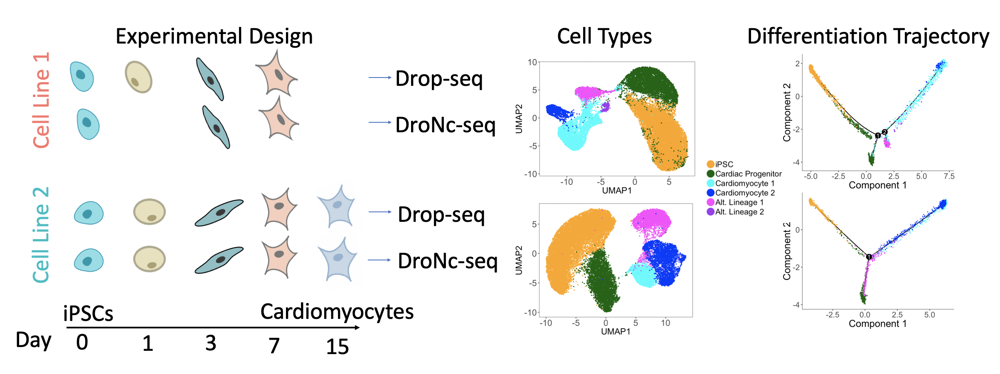

## Systematic Comparison of High-throughput Single-Cell and Single-Nucleus Transcriptomes during Cardiomyocyte Differentiation

### Getting Started

This github repository contains the `R` scripts used to generate all analyses for the paper. All dependencies and required functions are in `R/required_libs_funs.R`. Please source this file before attempting to run `main.R`.

The processed expression matrices can be found in a folder called `data`, which is available for download [here](https://drive.google.com/open?id=1IGApqHuQ2ZP-OxBBv54Q8qBS85GJzk9B).

